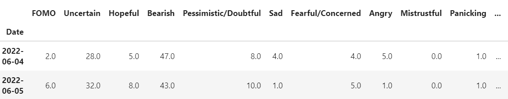
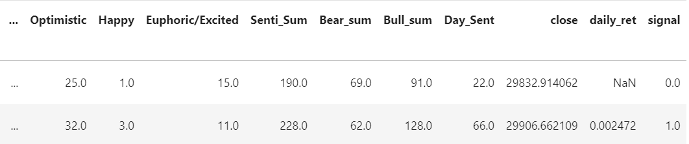
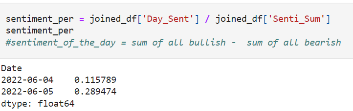
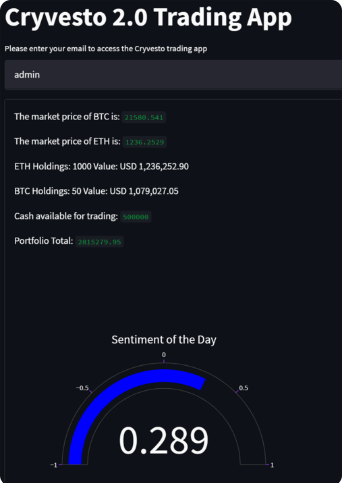

# Project 2: Cryvesto 2.0- Machine Learning Sentiment Trade Bot
--- 


*"Using a MachineLearning-Sentiment Trading Bot (ML-STB) that adopts trade signals from Social Media and News feeds about evolving markets ."* 


---
## Background
##
For Project Two, team Cryvesto 2.0 has embarked on constructing a Machine Learning Sentiment Trade Bot(ML_STB) that captures market expressions from news and social media sources and identifies ‘Bullish’ or ‘Bearish’ sentiment. We believe that positive and negative sentiments are signals for new market trends. These signals can be utilized to trigger an entry or exit point to trade targeted securities or assets. We believe that our hypothesis highlights the importance of ‘fear’ and ‘greed’ that influences market forces, which could be some of the leading indicators for trade points. 

A retail investor is innundated with business and political news, and world events that he/she struggles to keep track of how these might impact trading or investments. To minimize their personal 'fear' and 'greed'
impulse to trade, we identify the public market sentiment for them to be ahead of changing market force momentum and validate that the phrase: "The trend is your friend." 

Also, with the growth of high frequency trading(HFT) rising to 80% of market trading today, it gives cause to seek an additional approach from automated ML algorithm modeling based on technical indicator inputs. By encoding sentiments as ‘Bullish’ or ‘Bearish’ we aim to get an early advantage to place trades before the HFT herd using technical indicator trade signals. 

Team Cryvesto will utilize sentiments from social media and news data sites (like **twitter, reddit, The Wall Street Journal, and NewsAPI**), along with historical trading data to build a STB utilizing ML techniques that can predict whether to buy/sell or hold a Cryptocurrency.

--- 
## Hypothesis 

Our hypothesis is when 'Bullish' sentiment is higher than 'Bearish' sentiment the asset price will likely rise, and when 'Bearish' sentiment is higher than 'Bullish' sentiment the opposite will occur with a declining prices.  

First, the hypothesis that these sentiments are significant factors as trade signals will be established after backtesting the hypothesis against several ML models, followed by building a STB using the selected ML model.

---
## Acceptance Criteria  

The Cryvesto project must meet the following criteria:

* Establish the validity of the Hypothesis using sentiment feeds from Twitter and Reddit for Bitcoin and Ethereum Cryptocurrencies and testing with the following ML Models:
    - Logistic Regression
    - SVC
    - AdaBoost
    - Random Forest  
* Establish the validity of the Hypothesis using general news setiment from Wall Street Journal and testing with the following ML Models:
    - Logistic Regression
    - SVC
    - AdaBoost
    - Random Forest   
* Determine the best performing ML model that has greater than 50% accuracy and recall rates for prediciting the buy/sell signals  
* Using the selected model, build the Cryvesto 2.0 app utilizing **Streamlit** as the GUI that:
    - displays the sentiment of the day in a gauge meter format
    - prompts the user to select from Bitcoin/ Ethereum for trading
    - perform a paper trade using Alpaca Trade API   

---
## Evaluation Results

### Tests using crypto related sentiments from leading social media sites
* Developed the `mainline_twitter` Jupyter Notebook  
    - drawing sentiments from twitter feeds related to:
        - Bitcoin
        - Ethereum
    - obtained historical Ticker data from Yahoo Finance
    - tested in the following models:
       - Logistic Regression
       - SVC
       - AdaBoost
       - Random Forest
    - accumulated `Classification reports` in a results DataFrame and subsequently in a `csv` file for comparison purposes
    - saved `Actual Vs Strategy Returns` plots in respective PNG files for comparison purposes  

* Developed the `mainline_reddit` Jupyter Notebook  
    - drawing sentiments from reddit feed related to:
        - Bitcoin
        - Ethereum
    - obtained historical Ticker data from Yahoo Finance
    - tested on the follwoing models:
       - Logistic Regression
       - SVC
       - AdaBoost
       - Random Forest
    - accumulated `Classification reports` in a results DataFrame and subsequently in a `csv` file for comparison purposes
    - saved `Actual Vs Strategy Returns` plots in respective PNG files for comparison purposes  
                
### Tests using headlines from the leading business newspaper- Wall Street Journal
* Developed the `mainline_wsj` Jupyter Notebook  
    - drawing sentiments from historical `Wall Street Journal` news Headlines 
    - obtained historical Ticker data from Yahoo Finance
    - invented  our own proprietary signal strategy called **Simple Moving Average of Sentiments** akin to generally known SMAs, technical indicators which utilize price-derived returns. In our **SMA of Sentiments**, we utilize the sentiment values averaged over a short period of time (SMA-Short), and over a longer period of time (SMA-Long). We used `SMA Short` and `SMA Long` as the features for our ML models.  We tested the models with and without this strategy and very interestingly the results with the 'SMA of Sentiments' strategy was much better. 
    - tested on the following models:
       - Logistic Regression
       - SVC
       - AdaBoost
       - Random Forest
    - accumulated `Classification reports` in a results DataFrame and subsequently in a `csv` file for comparison purposes
    - saved `Actual Vs Strategy Returns` plots in respective PNG files for comparison purposes
    - tested with current top 20 headlines extracted from NewsAPI. 
---

## Hypothesis Test Results

The tests results are promising favoring `AdaBoost` model with about 60% accuracy in predicting buy/sell indicators when tested with social media sentiment feeds. See [twitter classification reports](twitter_classification_reports.pdf) and [reddit classification reports](reddit_classification_reports.pdf) here. 

The cumulative return plots appear very choppy unlike traditional cumulative return plots. We believe that is due to the very choppy data on Cryptos from the period selected. You can preview [cumulative returns plot with twitter feed](twitter_plots.pdf) and [cumulative returns plot with reddit feed](reddit_plots.pdf) here.  

We received similar results with over 50% accuracy 'The Wall Street Journal' news headlines. [Click here for WSJ classification report](classification_reports_wsj.pdf). The preview for [WSJ cumulative returns plot with different SMA windows](wsj_plots.pdf) are here. We believe that fine tuning of the SMA windows might give better results indicating that even the leading business news headlines may have similar impact on trading. This looks promising!

We chose `Adaboost` because its averages showed better predictability than the other models despite some of them demonstrating better cumulative returns at times. 

---
---

## Technologies
The application is developed using:  
* Language: Python 3.7   
* Libraries: Pandas; scikit-learn; NLTK and Streamlit
* The application tools needed to construct models to perform ML algorithms:`SVC`, `LogisticRegression`, `AdaBoostClassifier`, `DecisionTreeClassifier`.  
* Development Environment: VS Code and Terminal, Anaconda 2.1.1 with conda 4.11.0, Jupyterlab 3.2.9
* OS: Mac OS 12.1

---
## Installation Guide
Before running the applications open your terminal to install the libraries and verify them. The following are instructions to install the libraries for the applications.  

* [python](https://www.python.org/downloads/) 
* [anaconda3](https://docs.anaconda.com/anaconda/install/windows/e) 
* [pandas](https://pandas.pydata.org/docs/getting_started/install.html)
* [scikitlearn](https://scikit-learn.org/stable/install.html) 
* [NLTK](https://www.nltk.org/install.html)
* [streamlit](https://docs.streamlit.io/library/get-started/installation)

```python libraries
pip install -U scikit-learn
python -m pip show scikit-learn                           # to see which version of scikit-learn is installed
pip install --user -U nltk                                # library for Natural Language ToolKit
conda install numpy                                       # python library for scientific computing.
pip install streamlit                                     # python library to create custom web apps for ML.
```
```import pandas as pd
import numpy as np                                         # returns conditional classification values for signals
from pathlib import Path
import hvplot.pandas                                        # for chart visualations
import matplotlib.pyplot as plt
from sklearn import svm                                     # algorithm ML model
from sklearn.preprocessing import StandardScaler            # standardizes data for models 
from pandas.tseries.offsets import DateOffset               # allows length of time adjustments
from sklearn.metrics import classification_report           # renders metrics as classified reports
from sklearn.linear_model import LogisticRegression         # algorithm ML model
from sklearn.ensemble import AdaBoostClassifier             # algorithm ML model
from sklearn.tree import DecisionTreeClassifier             # algorithm ML model 
from nltk.sentiment.vader import SentimentIntensityAnalyzer # algorithms classifying lists of words as scores into positive and negative categories, created by Hutto, C.J. & Gilbert, E.E. (2014). VADER: A Parsimonious Rule-based Model for Sentiment Analysis of Social Media Text. 
import streamlit as st                                      # deploys python code into an interactive web app
```
### Clone the application code from Github as follows:
copy the URL link of the application from its Github repository      
open the Terminal window and clone as follows:  

   1. %cd to_your_preferred_directory_where_you want_to_store_this_application  
    
   2. %git clone URL_link_that_was_copied_in_step_1_above   
    
   3. %ls     
        CRYVESTO_2.0    
        
   4. %cd CRYVESTO_2.0    

The entire application files in the current directory are as follows:

* alpaca_trade_lib.py       (Alpaca trade lib)
* classification_reports_wsj.pdf
* classification_reports.csv
* load_data.py              (load api library)
* mainline_reddit.ipynb     (reddit feed notebook)
* mainline_twitter.ipynb    (twitter feed notebook)
* mainline_wsj.ipynb        (wsj data notebook)
* ml_lib.py                 (ml library)
* my_api.env          
* newslib.py                (newsapi lib)
* Pipfile
* README.md
* reddit_classification_reports.csv  
* reddit_classification_reports.pdf
* reddit_plots.pdf        (cumulative returns plots)
* results with reddit data only
* results with twitter data only
* results wsj data only
* trade_api.py             (alpaca order api)
* trade.ipynb
* twitter_classification_reports.csv
* twitter_classification_reports.pdf
* twitter_lib.py            (social media lib)
* twitter_plots.pdf         (cumulative returns plots)
* wsj_headlines.csv         (wsj headlines hitorical data)
* wsj_lib.py                (wsj lib)
* wsj_plots.pdf             (cumulative returns plots)
* xactcryptos.py
    
---

## Usage
The following details the instructions on how to run the applications.  

### Setup the environment and Run the application 

Setup the environment using conda as follows:

    5. %conda create dev -python=3.7 anaconda  
    
    6. %conda activate dev  
    
    7. %jupyter lab  

### Run the Notebooks
THIS ASSUMES FAMILIARITY WITH JUPYTER LAB. If not, then [click here for information on Jupyter Lab](https://jupyterlab.readthedocs.io/en/stable/).  

- After step 7 above, this will take you to the jupyter lab window, where you can open the application notebook **mainline_twitter.ipynb, or mainline_reddit.ipynb, or mainline_wsj.ipynb** and run the notebook to test the hypothesis with respective data source.  

### Run the Cryvest 2.0 App

Test your complete `Cryvesto` ledger and user interface by running your Streamlit application.
 Then test the interface.
To do so, complete the following steps:

 1. In the terminal, navigate to the project folder where you've coded the challenge.

 2. In the terminal, run the Streamlit application by using 'streamlit run ???????????.py`. 

The Cryvesto 2.0 GUI app prompts the user for an email id for validation purposes (currently, hardcoded to 'admin'). Please enter admin when prompted. The App displays the user's current account information and is presented with a Crypto Sentiment of the Day(CSD) displaying a gauge with values between -1 and 1. It then prompts the user for coin selection and to buy/sell with the amount. Then it executes the trade using Alpaca.

---
---
## Cryvesto 2.0 Trading App
##
The Graphic User Interface for the Cryvesto 2.0 trading app is built using Streamlit. This development app uses Alpaca API to trade cryptocurrency on a paper account. The code extracts it from api.env file, which is commented out for now. It will be reinstated in the production version.

Presently, the CSD is calculated from the 'Augmento' Bull/Bear sentiment counts picked from a day in June to provide current data. For future development, we will change the code to pick the current date. 

Joined dataframe of Bullish & Bearish texts with datetime and signals: 

 

 


The Cryptocurrency Sentiment of the Day signal: 

 

The Graphic User Interface for the Cryvesto 2.0 trading app is built using **Streamlit**.

 

#### **The Cryvesto 2.0 Sentiment Meter Gauge** 

In the next release, the App will use the Adabooster model to make a prediction to buy/sell and advise the trader accordingly.

---
--- 
## Contributors 
Ashok Pandey - ashok.pragati@gmail.com, www.linkedin.com/in/ashok-pandey-a7201237  
Dane Hayes - nydane1@gmail.com  
Scott Marler -scottjmarler@gmail.com, https://www.linkedin.com/in/scott-marler-212040b6/  
Rensley Ramos - ranly196@gmail.com, https://www.linkedin.com/in/rensley-2-nfty/    
Anna Joltaya - annajolt11.04@gmail.com, https://www.linkedin.com/in/anna-joltaya-15a66387/

---

## License
The source code is the property of the developer. The users can copy and use the code freely but the developer is not responsible for any liability arising out of the code and its derivatives.

---

=======
# CRYVESTO_2.0
Algorithmic Trading Application
>>>>>>> 93a1ee90315e331389179de12c0ee55b557f9f39
